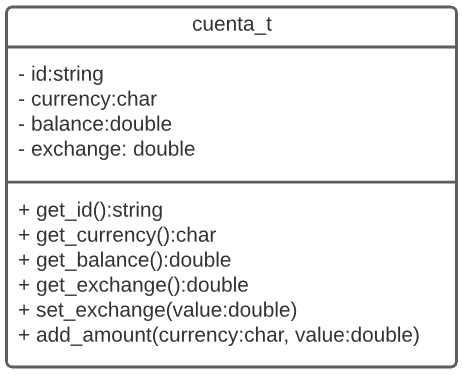

# Task #6: Clases, Objetos y Relaciones entre clases  
**course:** Programación Orientada a Objetos I  
**unit:** Unidad 6  
**cmake project:** poo1_sp7_v2021_1  
## Instructions

Cada pregunta deberá ser respondida en un archivo fuente (`.cpp`) y un archivo cabecera (`.h`) con el número de la pregunta:  
**NOTA:** Los archivos se encuentra dentro del folder **src**  
- `p1.cpp, p1.h`
- `p2.cpp, p2.h`
- `p3.cpp, p3.h`
- `p4.cpp, p4.h`
- `p5.cpp, p5.h`
- `p6.cpp, p6.h`
- Las declaraciones de las preguntas se encuentran en archivos `.h` y las definiciones en el archivo `.cpp`.
- Completar las respuestas dentro de esos archivos (`.h`, `.cpp`) y se requiere agregar alguna nueva función incluirla dentro de estos archivos.
- Los archivos deberán ser subidos directamente a www.gradescope.com.

## Question #1 - Casa Cercana (3 points)
  
### Problem Statement

Escribir un programa que utilizando la clase **`casa_t`** genere un vector de **`n`** casas y ubique la casa más cercana a una posición `(x, y)`:


### Input Format
```bash
4
Calle A 130
10 20
Calle B 210
20 30
Calle C 404
30 50
Calle D 111
11 15
1 1
```

### Constraints
```bash
- No utilizar etiquetas
- Numeros enteros
- Utilizar un arreglo  
```

### Output Format
```bash
dirección = Calle D 111
distancia = 17.20465053
```

## Question #2 - Mover Automovil (3 points)

### Problem Statement

Escribir un programa que utilizando la clase **`automobile_t`** determine la nueva posición de un automóvil, para lo cual se solicitará la ubicación inicial `(x, y)` del auto y cantidad `n` de instrucciones, debe considerarse que inicialmente el auto apunta hacia el eje `x`.  
Luego de ingresada el número de instrucciones se debe ingresar cada instrucción que está formada por un carácter que define la acción (`W`=Adelante, `S`=Atrás, `D`=Derecha y `A`=Izquierda) y un número entero que representa la magnitud en caso de `W` y `S` representa la longitud y en caso de `D` y `A` representa el ángulo expresado en grados sexagesimales:


### Input Format
```bash
0 0
6
W 10
D 90
W 40
S 20
A 90
W 10
```

### Constraints
```bash
- No utilizar etiquetas
- Numeros enteros
```

### Output Format
```bash
ubicacion = 20 -20 
```

## Question #3 - Cuenta de Ahorro (3 points)

### Problem Statement

Escribir un programa que utilizando la clase **`cuenta_t`** determine el saldo final de una cuenta, para ello el programa debe crearla  solicitando inicialmente:
- Número de cuenta (`id`),
- Moneda (`currency`) donde `S` es Soles y `D` Dolares
- Saldo inicial (`balance`) y
- Tipo de cambio (`exchange`).

Luego se debe ingresar `n` transacciones que incluyan la siguiente información:
- Moneda
- Importe  
  En caso las monedas no coincidan debe convertirse un importe al otro utilizando la siguiente formula:

```
[soles] = [dolares] x [tipo de cambio]
```



### Input Format
```bash
CTA001 S 100 3.6
4
S 100
D 50
S 20
S -50
```

### Constraints
```bash
- No utilizar etiquetas
- Numeros con decimales
```

### Output Format
```bash
el saldo es = 350 Soles 
```

## Question #4 - Asociación (3 points)

En una aplicación de renta de scooters, los scooters están representan por la clase (`scooter_t`) cada vez que es usado se le asigna un usuario (`user_t`), por lo que un scooter podría estar sin ser usado (`user = nullptr`). 

Basado en el diagrama, implementar el modelo de clases en C++ y una función (`listar_en_servicio(vector<scooter_t> scooters)`) que liste todos los scooters que no se encuentre usados.  
**Nota**: Se considera que un scooter no se usa si el atributo `user` es `nullptr`.


Escribir un programa que lea y genere un usuario `user_t` (nombre, apellido y dirección) y solicitar `n` scooters (identificador, latitud, longitud, tiene_user) y generar `n` objetos `scooter_t` almacenados en un `std::vector` el último valor servirá para asignar el usuario al scooter, si el valor de `tiene_user` es `T` entonces se le asigna usuario, si es `F` no se le asignara usuario, finalmente el vector de scooters deberá ser usado en la función `listar_en_servicio` el cual debera de listar solo los scooters que han sido asignados.

### Input Format
```bash
  pedro                   // Nombre
  sanchez                 // Apellido
  los águilas 123         // Dirección
  4                       // Cantidad 
  11 10 20 F              // Scooters..
  22 20 30 T
  33 30 40 T
  44 40 50 F
```

### Constraints
```bash
- No utilizar etiquetas
- Numeros enteros
- Se sugiere utilizar std::getline para std::string
```

### Output Format
```bash
  id: 22 posición: 20, 30 usuario: sanchez, pedro  
  id: 33 posición: 30, 40 usuario: sanchez, pedro  
```

## Question #5 - Composición (4 points)

Como se observa en el diagrama, un bus `bus_t` está formado por asientos `seat_t`. Se solicita implementar el modelo de clases en C++ y realizar un programa que genere un bus de (`r` filas y `c` columnas) y que se reserve `n` asientos y que verifique si un asiento  está disponible.


## Ejemplo 1
### Input Format
```bash
  5 4         // filas columnas
  2           // Cantidad de asientos reservados
  3 A         // Asiento 3A reservado
  2 C         // Asiento 2C reservado
  1 A         // Verificar si asiento 1A esta disponible
```

### Constraints
```bash
- No utilizar etiquetas
- Numeros enteros
```

### Output Format
```bash
  Asiento disponible
```
## Ejemplo 2
### Input Format
```bash
  5 4         // filas columnas
  ABC123      // placa vehicular
  2           // Cantidad de asientos reservados
  3 A         // Asiento 3A reservado
  2 C         // Asiento 2C reservado
  3 A         // Verificar si asiento 3A esta disponible
```

### Constraints
```bash
- No utilizar etiquetas
- Numeros enteros
```

### Output Format
```bash
  Asiento no disponible
```

## Question #6 - Herencia (4 points)

Según el diagrama, las piezas de ajedrez `piece_t` pueden ser de varios tipos, pero por simplificación se observan 2 tipos: caballos `knight_t` o alfiles `bishop_t`.
Implementar el diagrama de clases en C++ y realizar un programa que permita crear una instancia de `knight_t` y `bishop_t` y mostrar si el caballo o alfil se pueden mover a una posición válida (`can_move(x, y)`).


## Ejemplo 1
### Input Format
```bash
  C           // Tipo de Pieza (C=Caballo, A=Alfil)
  2 2         // Ubicación de Pieza (fila, columna)
  3 3         // Destino (fila, columna)
```

### Constraints
```bash
- No utilizar etiquetas
- Numeros enteros
```

### Output Format
```bash
  Destino invalido
```

## Ejemplo 2
### Input Format
```bash
  A           // Tipo de Pieza (C=Caballo, A=Alfil)
  2 2         // Ubicación de Pieza (fila, columna)
  6 6         // Destino (fila, columna)
```

### Constraints
```bash
- No utilizar etiquetas
- Numeros enteros
```

### Output Format
```bash
  Destino valido
```
